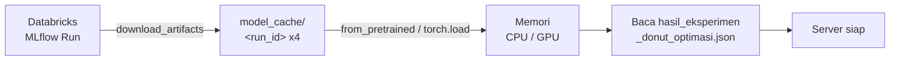
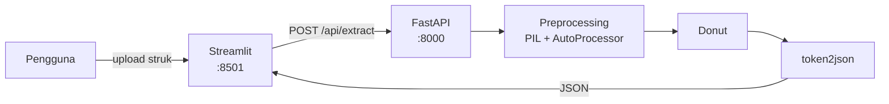

# Donut KIE — Ekstraksi Informasi Struk Belanja

Aplikasi demo untuk skripsi tentang **kompresi model Donut pada tugas Key Information Extraction (KIE) struk belanja**. Sistem ini membandingkan model Donut baseline dengan tiga varian hasil kompresi, sehingga trade-off antara akurasi, ukuran model, dan kecepatan inferensi bisa diamati langsung pada gambar struk sungguhan.

Donut (*Document Understanding Transformer*) adalah pendekatan **OCR-free**: gambar dokumen langsung dipetakan menjadi output JSON terstruktur tanpa tahap OCR terpisah, sehingga tidak ada akumulasi error dari modul OCR.

---

## Demo


---

## Varian Model

Empat model dibandingkan dalam penelitian ini. `run_id` di bawah sesuai dengan `DATABRICKS_RUN_IDS` pada `.env.example`; nama model diambil dari `metadata.json` di dalam artefak MLflow, bukan dari `.env`.

| MLflow Run ID | Nama Model | Teknik |
|---|---|---|
| `86eea36a77f6491cb7cd90bff992a22b` | `DONUT-Base` | Baseline, tanpa kompresi (`naver-clova-ix/donut-base-finetuned-cord-v2`) |
| `aad9049fe3234bbb82f7dca7f681eb5c` | `DONUT-P50-KD` | Structured pruning 50% + Knowledge Distillation |
| `b123f281a5e64c07892edabe66e3eed2` | `DONUT-P70-KD` | Structured pruning 70% + Knowledge Distillation |
| `06095fce5973418f99df2d92a4b68c11` | `DONUT-P30-KD-Q` | Structured pruning 30% + Knowledge Distillation + Dynamic Quantization |

Pruning yang dipakai adalah **structured pruning berbasis Taylor importance** pada neuron FFN decoder, dengan rasio yang diuji `[0.3, 0.5, 0.7]`. Setiap model hasil pruning kemudian dipulihkan lewat *knowledge distillation* dengan model baseline sebagai *teacher*. Varian `-Q` menambahkan *dynamic quantization* di atas hasil KD.

**Dataset:** [`naver-clova-ix/cord-v2`](https://huggingface.co/datasets/naver-clova-ix/cord-v2), memakai split bawaan HuggingFace (`train` / `validation` / `test`) tanpa split manual. Metrik F1 dan N-TED dihitung pada **100 sampel** dari split `test` (`EVAL_SAMPLES = 100`).

---

## Hasil Eksperimen

**Metrik evaluasi:** field-level Precision / Recall / F1-Score, dan **N-TED** (*normalized Tree Edit Distance*, semakin kecil semakin baik). Efisiensi diukur lewat ukuran artefak (MB), latensi per sampel (ms), dan FLOPs (GFLOPs).

### Kualitas ekstraksi & efisiensi

| Model | Precision | Recall | F1-Score | N-TED ↓ | Ukuran (MB) | Latensi (ms/sampel) | FLOPs (GFLOPs) |
|---|---|---|---|---|---|---|---|
| `DONUT-Base` | 0.8012 | 0.7956 | **0.7972** | **0.1093** | 768.94 | 761.61 | 394.44 |
| `DONUT-P50-KD` | 0.7937 | 0.7825 | 0.7873 | 0.1140 | 704.91 | 769.44 | 385.85 |
| `DONUT-P70-KD` | 0.7859 | 0.7805 | 0.7821 | 0.1216 | 679.27 | **754.50** | **382.41** |
| `DONUT-P30-KD-Q` | 0.7501 | 0.7453 | 0.7468 | 0.1396 | **623.58** | 3187.34 | 389.28 |

### Selisih terhadap baseline

Nilai positif pada kolom reduksi = lebih kecil/lebih cepat dari baseline; nilai negatif = lebih besar/lebih lambat.

| Model | Reduksi Ukuran | Reduksi Latensi | Reduksi FLOPs | F1 Drop | Kenaikan N-TED |
|---|---|---|---|---|---|
| `DONUT-Base` | — | — | — | — | — |
| `DONUT-P50-KD` | 8.33% | −1.03% | 2.18% | 0.0099 | 0.0047 |
| `DONUT-P70-KD` | 11.66% | 0.93% | 3.05% | 0.0151 | 0.0123 |
| `DONUT-P30-KD-Q` | 18.90% | −318.50% | 1.31% | 0.0504 | 0.0303 |

Khusus `DONUT-P30-KD-Q`, efek kuantisasi diukur juga terhadap *checkpoint*-nya sendiri sebelum PTQ: **ukuran −14.64%** dan **latensi −9.84%**.

> Angka pada tabel ini bersumber dari `hasil_eksperimen_donut_optimasi.json` (dibaca backend saat startup melalui `EXPERIMENT_RESULTS_PATH`) dan dari MLflow run yang tercantum pada tabel [Varian Model](#varian-model).

--- 

## Arsitektur Sistem

> **Databricks di sini hanya berfungsi sebagai penyimpanan artefak model, bukan sebagai mesin inferensi.** Model diunduh sekali dari MLflow saat backend pertama kali dijalankan, lalu di-*cache* secara lokal. Seluruh proses inferensi berjalan di mesin yang menjalankan backend (CPU atau GPU lokal).

### Alur startup (sekali di awal)



Pada startup berikutnya, tahap unduh dilewati selama `model_cache/<run_id>/model/metadata.json` masih ada. Model non-kuantisasi dimuat dengan `VisionEncoderDecoderModel.from_pretrained`; model terkuantisasi dimuat dengan `torch.load` dari file `.pt` dan tetap di CPU.

### Alur inferensi (per request)



Keempat model dimuat ke memori sekaligus saat startup, sehingga pengguna dapat berpindah model tanpa menunggu proses pemuatan ulang.

---

## Struktur Folder

```
Thesis-DONUT/
├── be/                          # Backend — FastAPI
│   ├── main.py                  # Entry point, lifespan (load & clear model)
│   ├── config/settings.py       # Konfigurasi dari .env (pydantic-settings)
│   ├── routes/                  # Definisi endpoint
│   ├── controller/              # Orkestrasi alur + penyimpanan log request
│   ├── service/                 # Integrasi Databricks/MLflow + inferensi Donut
│   ├── schema/                  # Model response Pydantic
│   ├── utils/                   # Logger & penyimpanan artefak per request
│   └── logs/                    # Log aplikasi & artefak per request (git-ignored)
├── fe/                          # Frontend — Streamlit
│   ├── app.py                   # Antarmuka pengguna
│   └── service.py               # Klien HTTP ke backend
├── notebook/
│   └── thesis-v1.ipynb          # Notebook training, kompresi & evaluasi
├── model_cache/                 # Cache model hasil unduhan, per run_id (git-ignored)
├── Dockerfile                   # Image tunggal (CPU-only torch) untuk backend & frontend
├── docker-compose.yml           # Orkestrasi 2 service + volume cache model
├── .env.example                 # Template variabel lingkungan
├── requirements.txt             # Dependensi untuk build Docker (pip)
└── pyproject.toml               # Dependensi untuk pengembangan lokal (uv)
```

---

## Setup & Installation

### Prerequisites

Salah satu dari:
  - **Docker**
  - **Python 3.12** + [`uv`](https://docs.astral.sh/uv/)

### Langkah

```powershell
# 1. Salin template konfigurasi
cp .env.example .env

# 2. Isi kredensial Databricks pada file .env

# 3. Install dependensi — hanya untuk mode lokal; lewati jika memakai Docker
uv sync
```

Konfigurasi `.env` sama untuk kedua mode. Yang berbeda hanya `API_BASE_URL`: pada mode Docker, nilainya ditimpa oleh `docker-compose.yml` menjadi `http://donut-backend:8000/api`.

### Variabel lingkungan

| Variabel | Keterangan |
|---|---|
| `DATABRICKS_HOST` | URL workspace Databricks, mis. `https://xxx.cloud.databricks.com` |
| `DATABRICKS_TOKEN` | Personal access token Databricks |
| `DATABRICKS_RUN_IDS` | Daftar MLflow run ID dalam format JSON array. **Elemen pertama harus model baseline.** |
| `DATABRICKS_DEVICE` | `cpu`, `cuda`, atau `auto` (default `auto`). Model terkuantisasi tetap dipaksa ke CPU. |
| `EXPERIMENT_RESULTS_PATH` | Path file metrik, relatif terhadap `be/` (default `../hasil_eksperimen_donut_optimasi.json`) |
| `API_BASE_URL` | Alamat backend yang dipanggil frontend (default `http://localhost:8000/api`) |

Nama model **tidak** lagi dikonfigurasi lewat `.env` — nama diambil dari `metadata.json` di dalam artefak MLflow, dengan `run_id` sebagai *fallback*.

### Catatan menjalankan pertama kali

Startup pertama mengunduh empat model Donut dari Databricks (**±2.8 GB** total, sesuai kolom ukuran pada tabel hasil eksperimen — butuh beberapa menit). Proses ini hanya terjadi sekali.

---

## Menjalankan Aplikasi

Tersedia dua cara: **Docker** (satu perintah, tidak perlu menyiapkan Python) atau **lokal dengan `uv`** (lebih cocok saat mengembangkan karena mendukung *hot reload*).

Keduanya membutuhkan file `.env` yang sudah terisi kredensial Databricks.

### Opsi A — Docker

```powershell
docker compose up --build
```

Perintah ini menyalakan dua service dari satu image yang sama:

| Service | Container | Port | Perintah |
|---|---|---|---|
| `backend` | `donut-backend` | 8000 | `uvicorn be.main:app --host 0.0.0.0 --port 8000` |
| `frontend` | `donut-frontend` | 8501 | `streamlit run fe/app.py --server.port 8501 --server.address 0.0.0.0` |

Beberapa hal yang perlu diketahui:

- **Image memakai PyTorch versi CPU-only** (`Dockerfile:16`), sehingga inferensi di dalam container berjalan di CPU. `docker-compose.yml` juga menetapkan `DATABRICKS_DEVICE=cpu` secara eksplisit. Untuk memakai GPU, image perlu dibangun ulang dengan wheel CUDA dan compose perlu ditambahi konfigurasi `deploy.resources.reservations.devices`.
- **Cache model disimpan pada named volume `model_cache`**, bukan pada folder proyek. Unduhan model karena itu bertahan antar `docker compose down` / `up`, tetapi **tidak** berbagi cache dengan `model_cache/` yang dipakai saat menjalankan secara lokal — masing-masing mengunduh sendiri.
- **Frontend memanggil backend lewat nama service**, bukan `localhost`: `API_BASE_URL=http://donut-backend:8000/api` di-*set* pada compose dan menimpa nilai dari `.env`.
- `.env` dibaca oleh compose melalui `env_file`, sekaligus dikecualikan dari image lewat `.dockerignore` — token tidak ikut terbawa ke dalam image.

Perintah pendukung:

```powershell
# Jalankan di latar belakang
docker compose up -d --build

# Pantau log backend (termasuk progres unduh model saat startup pertama)
docker compose logs -f backend

# Hentikan
docker compose down

# Hentikan sekaligus hapus cache model
docker compose down -v
```

> **Startup pertama lama.** Selain build image (unduh PyTorch dkk.), container backend masih harus mengunduh empat model dari Databricks. Frontend akan menampilkan daftar model kosong sampai backend selesai — pantau lewat `docker compose logs -f backend`.

### Opsi B — Lokal dengan `uv`

Jalankan dari **root proyek**, pada dua terminal terpisah.

**Terminal 1 — Backend**

```powershell
uv run uvicorn be.main:app --reload --port 8000
```

**Terminal 2 — Frontend**

```powershell
uv run streamlit run fe/app.py
```

> Harus dijalankan dari root proyek. `be/config/settings.py` membaca `.env` relatif terhadap direktori kerja, dan `model_cache/` juga dibuat relatif terhadapnya.

### Akses

Buka <http://localhost:8501>.

Dokumentasi API interaktif (Swagger) tersedia di <http://localhost:8000/docs>.

---

## Keterbatasan

1. **Belum bisa direproduksi pihak lain.** Docker menghilangkan hambatan penyiapan environment, tetapi tidak menyelesaikan masalah utamanya: menjalankan aplikasi ini tetap membutuhkan token Databricks milik penulis. Tanpa itu, model tidak dapat diunduh dan server tidak menyala. Agar penguji dapat mencoba demo secara mandiri, keempat model perlu diekspor ke lokasi yang bisa diakses publik (misalnya Hugging Face Hub atau GitHub Release).
2. **Evaluasi belum otomatis dari sisi aplikasi.** Angka pada tabel hasil berasal dari notebook dan disimpan sebagai JSON statis; backend hanya membacanya, tidak menghitung ulang. Perubahan model tanpa memperbarui JSON akan membuat metrik yang ditampilkan tidak sinkron.
3. **Metrik dihitung pada 100 sampel test**, bukan seluruh split `test` CORD-v2, sehingga selisih F1 antar varian yang kecil (mis. 0.0099 antara baseline dan P50-KD) perlu dibaca dengan hati-hati.
4. **Keempat model dimuat bersamaan** ke memori, sehingga kebutuhan RAM cukup besar dan startup relatif lama. Pendekatan ini dipilih agar perbandingan antar model tidak terganggu waktu tunggu pemuatan.
5. **Latensi antar model tidak sepenuhnya sebanding.** `DONUT-P30-KD-Q` dipaksa berjalan di CPU, sedangkan model lain mengikuti `DATABRICKS_DEVICE`. Perbandingan latensi yang adil menuntut seluruh model diukur pada perangkat yang sama.
6. **Kompresi tidak menghasilkan percepatan.** Reduksi FLOPs hanya 1–3% dan latensi praktis tidak berubah, sehingga manfaat kompresi pada penelitian ini terbatas pada penghematan ukuran/penyimpanan, bukan kecepatan inferensi.

---
