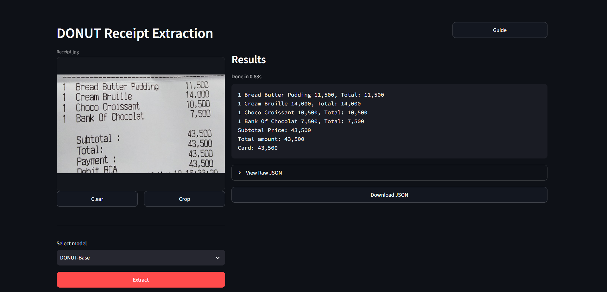
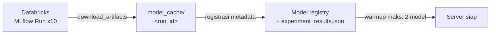
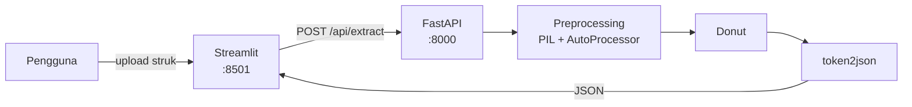

# DONUT Receipt Extraction | Ekstraksi Informasi Struk Belanja

Aplikasi demo untuk skripsi terkait **kompresi model DONUT pada tugas *Key Information Extraction (KIE)*** struk belanja Sistem ini membandingkan model DONUT baseline dengan sembilan varian hasil kompresi, hasil *Taylor Network Pruning* iteratif pada tiga intensitas **(30%, 50%, 70%)**, yang masing-masing dievaluasi tanpa pemulihan, setelah *knowledge distillation*, dan setelah tambahan kunatisasi *INT8 weight only*, sehingga *trade-off* antara akurasi (*Field-Level F1 Score* dan *N-TED*), ukuran model, dan kecepatan inferensi bisa diamati langsung pada gambar struk sungguhan.

DONUT (*Document Understanding Transformer*) adalah pendekatan **OCR-free**: gambar dokumen langsung dipetakan menjadi output JSON terstruktur tanpa tahap OCR terpisah, sehingga tidak ada akumulasi error dari modul OCR.

---

## Demo



---

## Varian Model

Sepuluh model dibandingkan dalam penelitian ini: satu baseline plus tiga intensitas pruning (30% / 50% / 70%), di mana tiap intensitas menghasilkan tiga run berurutan — `P{r}` (*pruning* saja), `P{r}-KD` (setelah distilasi), dan `P{r}-KD-Q` (setelah kuantisasi). Nama model diambil dari `metadata.json` di dalam artefak MLflow, bukan dari `.env`; `run_id` di bawah bisa dipakai untuk mengisi `DATABRICKS_RUN_IDS` pada `.env.example`.

| MLflow Run ID | Nama Model | Teknik |
|---|---|---|
| `45b10c9aee4d4dcc8aa1af2ad2a5b097` | `DONUT-Base` | Baseline, tanpa kompresi (`naver-clova-ix/donut-base-finetuned-cord-v2`) |
| `90262bed1b8a45f887e03487f6d98675` | `DONUT-P30` | Structured pruning 30% |
| `27dc3dabc16741f8bbf39bdb83b219a0` | `DONUT-P30-KD` | Structured pruning 30% + Knowledge Distillation |
| `bf77ff7b4f9f4840927b9bd4ea28c3e3` | `DONUT-P30-KD-Q` | Structured pruning 30% + Knowledge Distillation + Quantization INT8 |
| `3bd6e7d3506e43bab03234a308064595` | `DONUT-P50` | Structured pruning 50% |
| `2ab64e4093a943c0b7d6383a4d268c98` | `DONUT-P50-KD` | Structured pruning 50% + Knowledge Distillation |
| `f72b13a9d31e4191aa0444cb71a743da` | `DONUT-P50-KD-Q` | Structured pruning 50% + Knowledge Distillation + Quantization INT8 |
| `b899f00d74814fb897b0894c51e28098` | `DONUT-P70` | Structured pruning 70% |
| `d013c0d8fd59482e93e806529422b509` | `DONUT-P70-KD` | Structured pruning 70% + Knowledge Distillation |
| `b2bf02b55ed1474494295d956932fbb1` | `DONUT-P70-KD-Q` | Structured pruning 70% + Knowledge Distillation + Quantization INT8 |

Pruning yang dipakai adalah **structured pruning berbasis Taylor importance** pada neuron FFN decoder, dengan rasio yang diuji `[0.3, 0.5, 0.7]`. Skor Taylor dihitung sekali dari baseline lalu dipakai ulang untuk ketiga rasio, sehingga perbedaan antar rasio murni berasal dari banyaknya neuron yang dibuang. Setiap model hasil pruning kemudian dipulihkan lewat *knowledge distillation* selama 15 epoch dengan model baseline sebagai *teacher* (KL divergence pada logits decoder). Varian `-Q` menambahkan *weight-only dynamic quantization* INT8 (torchao) di atas hasil KD.

**Dataset:** [`naver-clova-ix/cord-v2`](https://huggingface.co/datasets/naver-clova-ix/cord-v2), memakai split bawaan HuggingFace (`train` / `validation` / `test`) tanpa split manual. Metrik F1 dan N-TED dihitung pada **100 sampel** dari split `test` (`EVAL_SAMPLES = 100`).

---

## Hasil Eksperimen

**Metrik evaluasi:** field-level Precision / Recall / F1-Score, dan **N-TED** (*normalized Tree Edit Distance*, semakin kecil semakin baik). Efisiensi diukur lewat ukuran artefak (MB), latensi per sampel (ms), dan FLOPs (GFLOPs). Seluruh pengukuran latensi dilakukan pada GPU (CUDA).

### Kualitas ekstraksi & efisiensi

| Model | Precision | Recall | F1-Score | N-TED ↓ | Ukuran (MB) | Latensi (ms/sampel) | FLOPs (GFLOPs) |
|---|---|---|---|---|---|---|---|
| `DONUT-Base` | 0.8012 | 0.7956 | **0.7972** | **0.1093** | 768.94 | 837.21 | 394.44 |
| `DONUT-P30` | 0.7655 | 0.7545 | 0.7591 | 0.1270 | 730.52 | 827.44 | 389.28 |
| `DONUT-P30-KD` | 0.7835 | 0.7762 | 0.7785 | 0.1313 | 730.52 | 868.60 | 389.28 |
| `DONUT-P30-KD-Q` | 0.7839 | 0.7762 | 0.7786 | 0.1298 | 624.09 | 912.60 | 389.28 |
| `DONUT-P50` | 0.6262 | 0.5737 | 0.5955 | 0.2561 | 704.91 | 815.51 | 385.85 |
| `DONUT-P50-KD` | 0.7636 | 0.7530 | 0.7574 | 0.1246 | 704.91 | 844.96 | 385.85 |
| `DONUT-P50-KD-Q` | 0.7630 | 0.7486 | 0.7542 | 0.1322 | 617.66 | 883.67 | 385.85 |
| `DONUT-P70` | 0.1232 | 0.0361 | 0.0531 | 0.8321 | 679.27 | 4206.82 | 382.41 |
| `DONUT-P70-KD` | 0.7859 | 0.7805 | 0.7821 | 0.1216 | 679.27 | 840.39 | **382.41** |
| `DONUT-P70-KD-Q` | 0.7866 | 0.7806 | 0.7826 | 0.1217 | **611.22** | 878.18 | **382.41** |

### Selisih terhadap baseline

Nilai positif pada kolom reduksi = lebih kecil/lebih cepat dari baseline; nilai negatif = lebih besar/lebih lambat.

| Model | Reduksi Ukuran | Reduksi Latensi | Reduksi FLOPs | F1 Drop | Kenaikan N-TED |
|---|---|---|---|---|---|
| `DONUT-P30` | 5.00% | +1.17% | 1.31% | 0.0381 | 0.0177 |
| `DONUT-P30-KD` | 5.00% | −3.75% | 1.31% | 0.0187 | 0.0220 |
| `DONUT-P30-KD-Q` | 18.84% | −9.01% | 1.31% | 0.0186 | 0.0205 |
| `DONUT-P50` | 8.33% | +2.59% | 2.18% | 0.2017 | 0.1468 |
| `DONUT-P50-KD` | 8.33% | −0.93% | 2.18% | 0.0398 | 0.0153 |
| `DONUT-P50-KD-Q` | 19.67% | −5.55% | 2.18% | 0.0430 | 0.0229 |
| `DONUT-P70` | 11.66% | −402.48% | 3.05% | 0.7441 | 0.7228 |
| `DONUT-P70-KD` | 11.66% | −0.38% | 3.05% | 0.0151 | 0.0123 |
| `DONUT-P70-KD-Q` | 20.51% | −4.89% | 3.05% | 0.0146 | 0.0124 |

Untuk ketiga varian `-Q`, efek kuantisasi diukur juga terhadap *checkpoint* KD-nya masing-masing sebelum PTQ:

| Model | Reduksi Ukuran vs pre-PTQ | Reduksi Latensi vs pre-PTQ |
|---|---|---|
| `DONUT-P30-KD-Q` | −14.57% | −5.26% |
| `DONUT-P50-KD-Q` | −12.38% | −4.15% |
| `DONUT-P70-KD-Q` | −10.02% | −5.07% |

> Angka pada tabel ini bersumber dari `be/config/experiment_results.json` (dibaca backend saat startup melalui `EXPERIMENT_RESULTS_PATH`) dan dari MLflow run yang tercantum pada tabel [Varian Model](#varian-model).

--- 

## Arsitektur Sistem

> **Databricks di sini hanya berfungsi sebagai penyimpanan artefak model, bukan sebagai mesin inferensi.** Artefak kesepuluh model diunduh sekali dari MLflow saat backend pertama kali dijalankan, lalu di-*cache* secara lokal. Seluruh proses inferensi berjalan di mesin yang menjalankan backend (CPU atau GPU lokal).

### Alur startup (sekali di awal)



Pada startup berikutnya, tahap unduh dilewati selama `model_cache/<run_id>/model/metadata.json` masih ada. Model **tidak** dimuat sekaligus ke memori: pemuatan bersifat *lazy* (saat request pertama memakai model tersebut) dengan eviksi LRU, dibatasi `MAX_RESIDENT_MODELS` (default 2). Saat startup backend hanya melakukan *warmup* hingga batas tersebut agar inisialisasi kernel CUDA/kuantisasi tidak menghantari request sungguhan.

Model non-kuantisasi dimuat dengan `VisionEncoderDecoderModel.from_pretrained`; model terkuantisasi dibangun ulang dari `config.json`, dikuantisasi ulang via torchao, lalu bobot INT8-nya dimuat dengan `torch.load(..., assign=True)`. Keduanya mengikuti `DATABRICKS_DEVICE` — termasuk CUDA.

### Alur inferensi (per request)



Berpindah model tetap memungkinkan tanpa unduh ulang; hanya ada jeda pemuatan jika model yang dituju belum berada di dalam batas LRU.

---

## Struktur Folder

```
Thesis-DONUT/
├── be/                          # Backend — FastAPI
│   ├── main.py                  # Entry point, lifespan (register, warmup & clear model)
│   ├── config/settings.py       # Konfigurasi dari .env (pydantic-settings)
│   ├── config/experiment_results.json  # Metrik hasil eksperimen 10 varian
│   ├── routes/                  # Definisi endpoint
│   ├── controller/              # Orkestrasi alur + penyimpanan log request
│   ├── service/                 # Integrasi Databricks/MLflow + inferensi Donut
│   ├── schema/                  # Model response Pydantic
│   ├── utils/                   # Logger & penyimpanan artefak per request
│   └── logs/                    # Log aplikasi & artefak per request (git-ignored)
├── fe/                          # Frontend — Streamlit
│   ├── app.py                   # Antarmuka pengguna
│   ├── tutorial.py              # Dialog tutorial 4 langkah
│   └── service.py               # Klien HTTP ke backend
├── notebook/
│   └── thesis_v3.ipynb          # Notebook training, kompresi & evaluasi
├── model_cache/                 # Cache model hasil unduhan, per run_id (git-ignored)
├── Dockerfile                   # Image tunggal (CPU-only torch) untuk backend & frontend
├── docker-compose.yml           # Orkestrasi 2 service + volume cache model
├── .env.example                 # Template variabel lingkungan
├── requirements.txt             # Dependensi untuk build Docker (pip)
└── pyproject.toml               # Dependensi untuk pengembangan lokal (uv)
```

---

## Setup & Installation

### Prerequisites

Salah satu dari:
  - **Docker**
  - **Python 3.12** + [`uv`](https://docs.astral.sh/uv/)

### Langkah

```python
# 1. Salin template konfigurasi
cp .env.example .env

# 2. Isi kredensial Databricks pada file .env

# 3. Install dependensi — hanya untuk mode lokal; lewati jika memakai Docker
uv sync
```

Konfigurasi `.env` sama untuk kedua mode. Yang berbeda hanya `API_BASE_URL`: pada mode Docker, nilainya ditimpa oleh `docker-compose.yml` menjadi `http://donut-backend:8000/api`.

### Variabel lingkungan

| Variabel | Keterangan |
|---|---|
| `DATABRICKS_HOST` | URL workspace Databricks, mis. `https://xxx.cloud.databricks.com` |
| `DATABRICKS_TOKEN` | Personal access token Databricks |
| `DATABRICKS_RUN_IDS` | Daftar MLflow run ID dalam format JSON array — boleh subset atau seluruh 10 run ID pada tabel [Varian Model](#varian-model), urutan bebas |
| `DATABRICKS_DEVICE` | `cpu`, `cuda`, atau `auto` (default `auto`) |
| `MAX_RESIDENT_MODELS` | Jumlah maksimum model yang menempel di memori (LRU), default 2 |
| `EXPERIMENT_RESULTS_PATH` | Path file metrik, relatif terhadap folder `be/` (default `./config/experiment_results.json`) |
| `API_BASE_URL` | Alamat backend yang dipanggil frontend (default `http://localhost:8000/api`) |

Nama model **tidak** dikonfigurasi lewat `.env` — nama diambil dari `metadata.json` di dalam artefak MLflow, dengan `run_id` sebagai *fallback*.

### Catatan menjalankan pertama kali

Startup pertama mengunduh artefak **kesepuluh** model Donut dari Databricks (**±6.7 GB** total, sesuai kolom ukuran pada tabel hasil eksperimen — butuh beberapa menit). Proses ini hanya terjadi sekali; jika ingin lebih ringan, isi `DATABRICKS_RUN_IDS` dengan subset varian yang benar-benar dipakai.

---

## Menjalankan Aplikasi

Tersedia dua cara: **Docker** (satu perintah, tidak perlu menyiapkan Python) atau **lokal dengan `uv`** (lebih cocok saat mengembangkan karena mendukung *hot reload*).

Keduanya membutuhkan file `.env` yang sudah terisi kredensial Databricks.

### Opsi A — Docker

```powershell
docker compose up --build
```

Perintah ini menyalakan dua service dari satu image yang sama:

| Service | Container | Port | Perintah |
|---|---|---|---|
| `backend` | `donut-backend` | 8000 | `uvicorn be.main:app --host 0.0.0.0 --port 8000` |
| `frontend` | `donut-frontend` | 8501 | `streamlit run fe/app.py --server.port 8501 --server.address 0.0.0.0` |

Beberapa hal yang perlu diketahui:

- **Image memakai PyTorch versi CPU-only** (`Dockerfile:16`), sehingga inferensi di dalam container efektif berjalan di CPU meskipun `docker-compose.yml` men-set `DATABRICKS_DEVICE=auto`. Untuk memakai GPU, image perlu dibangun ulang dengan wheel CUDA.
- **Cache model disimpan pada named volume `model_cache`**, bukan pada folder proyek. Unduhan model karena itu bertahan antar `docker compose down` / `up`, tetapi **tidak** berbagi cache dengan `model_cache/` yang dipakai saat menjalankan secara lokal — masing-masing mengunduh sendiri.
- **Frontend memanggil backend lewat nama service**, bukan `localhost`: `API_BASE_URL=http://donut-backend:8000/api` di-*set* pada compose dan menimpa nilai dari `.env`.
- `.env` dibaca oleh compose melalui `env_file`, sekaligus dikecualikan dari image lewat `.dockerignore` — token tidak ikut terbawa ke dalam image.

Perintah pendukung:

```powershell
# Jalankan di latar belakang
docker compose up -d --build

# Pantau log backend (termasuk progres unduh model saat startup pertama)
docker compose logs -f backend

# Hentikan
docker compose down

# Hentikan sekaligus hapus cache model
docker compose down -v
```

> **Startup pertama lama.** Selain build image (unduh PyTorch dkk.), container backend masih harus mengunduh artefak kesepuluh model dari Databricks. Frontend akan menampilkan daftar model kosong sampai backend selesai — pantau lewat `docker compose logs -f backend`.

### Opsi B — Lokal dengan `uv`

Jalankan dari **root proyek**, pada dua terminal terpisah.

**Terminal 1 — Backend**

```powershell
uv run uvicorn be.main:app --reload --port 8000
```

**Terminal 2 — Frontend**

```powershell
uv run streamlit run fe/app.py
```

> Harus dijalankan dari root proyek. `be/config/settings.py` membaca `.env` relatif terhadap direktori kerja, dan `model_cache/` juga dibuat relatif terhadapnya.

### Akses

Buka <http://localhost:8501>.

Dokumentasi API interaktif (Swagger) tersedia di <http://localhost:8000/docs>.

---

## Keterbatasan

1. **Belum bisa direproduksi pihak lain.** Docker menghilangkan hambatan penyiapan environment, tetapi tidak menyelesaikan masalah utamanya: menjalankan aplikasi ini tetap membutuhkan token Databricks milik penulis. Tanpa itu, model tidak dapat diunduh dan server tidak menyala. Agar penguji dapat mencoba demo secara mandiri, kesepuluh model perlu diekspor ke lokasi yang bisa diakses publik (misalnya Hugging Face Hub atau GitHub Release).
2. **Evaluasi belum otomatis dari sisi aplikasi.** Angka pada tabel hasil berasal dari notebook dan disimpan sebagai JSON statis (`be/config/experiment_results.json`); backend hanya membacanya, tidak menghitung ulang. Perubahan model tanpa memperbarui JSON akan membuat metrik yang ditampilkan tidak sinkron.
3. **Metrik dihitung pada 100 sampel test**, bukan seluruh split `test` CORD-v2, sehingga selisih F1 antar varian yang kecil (mis. 0.0146 antara baseline dan `DONUT-P70-KD-Q`) perlu dibaca dengan hati-hati.
4. **Rekomendasi akhir dibatasi pada tiga varian pilihan tim.** Kesepuluh varian diuji untuk keperluan analisis trade-off, tetapi hanya tiga yang direkomendasikan sebagai model final, yaitu `[TODO-MODEL-1]`, `[TODO-MODEL-2]`, dan `[TODO-MODEL-3]`. <!-- TODO: ganti placeholder dengan 3 model final pilihan tim --> Varian lainnya tetap tersedia di aplikasi sebagai bahan perbandingan, bukan sebagai kandidat deploy.
5. **Kompresi tidak menghasilkan percepatan.** Reduksi FLOPs hanya ~1–3%, sedangkan latensi cenderung sedikit lebih lambat dari baseline, sehingga manfaat kompresi pada penelitian ini terbatas pada penghematan ukuran/penyimpanan, bukan kecepatan inferensi.

---
